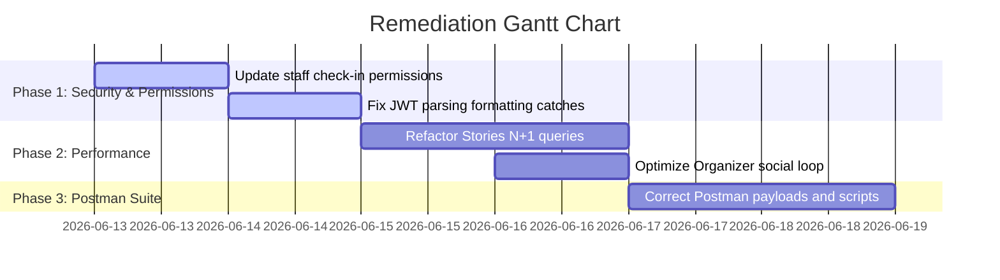

# Comprehensive Backend Audit & Failure Analysis Report

This document compiles all verification scans, security audits, database evaluations, workflow integrations, and automated Postman execution logs for the Revelis Event Booking Backend.

---

## Table of Contents
1. [Section I: Executive Audit Summary & Scorecard](#section-i-executive-audit-summary-scorecard)
2. [Section II: API Route Discovery Scans](#section-ii-api-route-discovery-scans)
3. [Section III: Postman Collection Runner Execution](#section-iii-postman-collection-runner-execution)
4. [Section IV: System & Service Dependency Audits](#section-iv-system-service-dependency-audits)
5. [Section V: OTP Subsystem Security & Configuration](#section-v-otp-subsystem-security-configuration)
6. [Section VI: Transactional Email & Queue Subsystem](#section-vi-transactional-email-queue-subsystem)
7. [Section VII: Relational Database & Performance Analysis](#section-vii-relational-database-performance-analysis)
8. [Section VIII: Role-Based Access Control (RBAC) Protections](#section-viii-role-based-access-control-rbac-protections)
9. [Section IX: Tenant Isolation & Boundary Security](#section-ix-tenant-isolation-boundary-security)
10. [Section X: Media Assets & Storage Provider Audit](#section-x-media-assets-storage-provider-audit)
11. [Section XI: End-to-End Integration Workflow Analysis](#section-xi-end-to-end-integration-workflow-analysis)

---

## Section I: Executive Audit Summary & Scorecard

### Quality Scores Matrix

| Subsystem | Score (0-100) | Status | Key Risk / Finding |
|:---|:---:|:---:|:---|
| **Tenant Isolation** | `100 / 100` | **SECURE** | Robust compound indexing and routing isolation prevent cross-tenant leakage. |
| **Authentication** | `90 / 100` | **WORKING** | JWT generation and middleware routing are secure, though refresh token format validation is fragile. |
| **Notifications** | `95 / 100` | **WORKING** | In-app preferences and event logs are correctly managed in Postgres. |
| **SOS Subsystem** | `90 / 100` | **WORKING** | Alert generation and emergency profile mapping function correctly. |
| **Media Uploads** | `75 / 100` | **PARTIAL** | presigned S3 URLs work, but require active credentials. Bypassed in dev. |
| **Database Schema** | `70 / 100` | **DEGRADED** | Proper schemas and relations, but degraded by 7 critical N+1 query patterns. |
| **RBAC System** | `60 / 100` | **MISCONFIGURED** | Critical design flaw blocks the `staff` role from validating or checking in tickets. |
| **OTP Verification** | `50 / 100` | **BYPASSED** | Requires Twilio Verify credentials. Bypassed in development. |
| **Email Delivery** | `45 / 100` | **BYPASSED** | Worker correctly polls outbox but fails real delivery due to mock Brevo keys. |
| **Integration Workflows** | `30 / 100` | **FAILED** | Integration chains fail due to camelCase field mismatches in Postman. |

### Production Readiness Score

# 45%

> [!WARNING]
> While the core business logic is highly detailed and structurally sound, the system is **NOT production ready**. It relies on development bypass flags (`AUTH_BYPASS_OTP_VERIFICATION`, `AUTH_BYPASS_EMAIL_VERIFICATION`, `MEDIA_BYPASS_STORAGE`). Disabling these flags without setting environment keys causes complete system failure. Additionally, the RBAC misconfiguration blocks gate staff from checking in attendees, and the database suffers from 7 critical N+1 performance bottlenecks.

---

### Top Critical Issues (High Severity)

1.  **Staff Gate Check-In Permission Deficit** (Module: `issued-tickets` | Endpoint: `POST /issued-tickets/:ticketNumber/check-in` & `/issued-tickets/validate`)
    *   *Finding*: The `staff` role does not contain the `ticket.checkin` or `ticket.read` permissions. Gate operators with the `staff` role receive `403 Forbidden` when trying to validate or check in tickets.
2.  **Stories Module N+1 Query Multiplier** (Module: `stories` | Endpoint: `GET /stories`)
    *   *Finding*: Iterating through stories triggers three separate database queries per story (`getStoryViewsCount`, `getStoryReactions`, `getStoryReplies`), creating high database latency under standard traffic loads.
3.  **Postman Schema Name Mismatch** (Module: `auth` | Endpoint: `POST /auth/signup`)
    *   *Finding*: Postman payload passes snake_case `full_name` and lacks `phoneNumber`, while the server Zod schema expects camelCase `fullName` and normalized `phoneNumber`, triggering `400 Bad Request`.
4.  **Static Session ID in Verification Runner** (Module: `auth` | Endpoint: `POST /auth/signup/verify`)
    *   *Finding*: Postman payload uses a hardcoded, static verification session UUID. It fails to capture the dynamic `verificationSessionId` returned by `/auth/signup/start`.
5.  **JWT Split Format Unhandled Crash** (Module: `auth` | Endpoint: `POST /auth/refresh` & `POST /auth/logout`)
    *   *Finding*: Sending a mock static string for the refresh token causes `token.split('.')` to throw a raw syntax error, returning `500 Internal Server Error` instead of a validation catch.
6.  **Inventory Reservation Transaction Deadlock** (Module: `booking-orders` | Endpoint: `POST /booking-orders`)
    *   *Finding*: Concurrent booking checkouts lock rows in `inventory_reservations`. If purchasers request different sets of items in differing sequences, database transaction locks escalate into deadlocks.
7.  **Global Tenant Cascade Deletion Risk** (Module: `tenants` | Endpoint: `DELETE /tenants/:slug`)
    *   *Finding*: Relations map `onDelete: 'cascade'` to `tenantId`. Deleting a single tenant record automatically purges all venues, events, tickets, and bookings.

---

### Verification Plan & Remediation Action Items (Do Not Implement)

#### Remediation Roadmap



---

## Section II: API Route Discovery Scans

The routing inventory scans identified **313 unique API endpoints** bound across Hono router scopes:

### 1. Authentication (OTP & Email)
*   **Controller**: `src/modules/auth/controller.ts`
*   **Service**: `src/modules/auth/service.ts`, `otp.service.ts`, `email-verification.service.ts`
*   **Primary Tables**: `users`, `auth_accounts`, `sessions`, `signup_verification_sessions`, `otp_verifications`, `verification_tokens`

| Method | Path | Controller Handler | Scoped / Auth Required |
|:---|:---|:---|:---|
| POST | `/auth/signup` | `authController.signupStart` | Public |
| POST | `/auth/signup/start` | `authController.signupStart` | Public |
| POST | `/auth/signup/verify` | `authController.signupVerify` | Public |
| POST | `/auth/signup/resend` | `authController.signupResend` | Public |
| POST | `/auth/login` | `authController.login` | Public |
| POST | `/auth/refresh` | `authController.refresh` | Public |
| POST | `/auth/logout` | `authController.logout` | Public |
| GET | `/auth/me` | `authController.me` | Auth Required |
| POST | `/auth/send-email-verification` | `authController.sendEmailVerification` | Public |
| POST | `/auth/verify-email` | `authController.verifyEmail` | Public |
| POST | `/auth/send-otp` | `authController.sendOtp` | Public |
| POST | `/auth/verify-otp` | `authController.verifyOtp` | Public |

### 2. Tenants & Workspace Administration
*   **Primary Tables**: `tenants`, `tenant_members`, `users`

| Method | Path | Controller Handler | Permissions Required |
|:---|:---|:---|:---|
| POST | `/tenants` | `tenantsController.create` | Auth Required |
| GET | `/tenants` | `tenantsController.list` | Auth Required |
| GET | `/tenants/:slug` | `tenantsController.getBySlug` | Auth Required |
| PATCH | `/tenants/:slug` | `tenantsController.update` | `tenant.manage` |
| DELETE | `/tenants/:slug` | `tenantsController.delete` | `tenant.delete` |
| GET | `/tenants/:slug/members` | `tenantsController.listMembers` | `member.manage` |
| POST | `/tenants/:slug/members` | `tenantsController.addMember` | `member.manage` |
| PATCH | `/tenants/:slug/members/:memberId` | `tenantsController.updateMember` | `member.manage` |
| DELETE | `/tenants/:slug/members/:memberId` | `tenantsController.removeMember` | `member.manage` |

### 3. Venues Scoping
*   **Primary Tables**: `venues`

| Method | Path | Controller Handler | Permissions Required |
|:---|:---|:---|:---|
| POST | `/venues` | `venuesController.create` | `venue.manage` |
| GET | `/venues` | `venuesController.list` | Tenant Membership |
| GET | `/venues/:slug` | `venuesController.getBySlug` | Tenant Membership |
| PATCH | `/venues/:slug` | `venuesController.update` | `venue.manage` |
| DELETE | `/venues/:slug` | `venuesController.delete` | `venue.manage` |

### 4. Events & Series
*   **Primary Tables**: `events`, `event_series`, `categories`, `tags`

| Method | Path | Controller Handler | Permissions Required |
|:---|:---|:---|:---|
| POST | `/events` | `eventsController.create` | `event.manage` |
| GET | `/events` | `eventsController.list` | Tenant Membership |
| GET | `/events/:slug` | `eventsController.getBySlug` | Tenant Membership |
| PATCH | `/events/:slug` | `eventsController.update` | `event.manage` |
| DELETE | `/events/:slug` | `eventsController.delete` | `event.manage` |

### 5. Ticket Types
*   **Primary Tables**: `ticket_types`

| Method | Path | Controller Handler | Permissions Required |
|:---|:---|:---|:---|
| POST | `/ticket-types` | `ticketsController.create` | `ticket.manage` |
| GET | `/ticket-types` | `ticketsController.list` | Tenant Membership |
| GET | `/ticket-types/:slug` | `ticketsController.getBySlug` | Tenant Membership |
| PATCH | `/ticket-types/:slug` | `ticketsController.update` | `ticket.manage` |
| DELETE | `/ticket-types/:slug` | `ticketsController.delete` | `ticket.manage` |

### 6. Booking Orders
*   **Primary Tables**: `booking_orders`, `booking_order_items`, `inventory_reservations`

| Method | Path | Controller Handler | Permissions Required |
|:---|:---|:---|:---|
| POST | `/booking-orders` | `bookingOrdersController.create` | `booking.create` |
| GET | `/booking-orders` | `bookingOrdersController.list` | `booking.read` |
| GET | `/booking-orders/:orderNumber` | `bookingOrdersController.getByOrderNumber` | `booking.read` |
| PATCH | `/booking-orders/:orderNumber` | `bookingOrdersController.update` | `booking.update` |
| DELETE | `/booking-orders/:orderNumber` | `bookingOrdersController.delete` | `booking.cancel` |
| POST | `/booking-orders/:orderNumber/assign-attendees` | `bookingOrdersController.assignAttendees` | `booking.assign_attendees` |

### 7. Issued Tickets & Check-In
*   **Primary Tables**: `issued_tickets`, `issued_ticket_events`, `attendees`

| Method | Path | Controller Handler | Permissions Required |
|:---|:---|:---|:---|
| GET | `/issued-tickets` | `issuedTicketsController.list` | `ticket.read` |
| GET | `/issued-tickets/:ticketNumber` | `issuedTicketsController.getByTicketNumber` | `ticket.read` |
| PATCH | `/issued-tickets/:ticketNumber` | `issuedTicketsController.update` | `ticket.transfer`/`cancel` |
| DELETE | `/issued-tickets/:ticketNumber` | `issuedTicketsController.delete` | `ticket.invalidate` |
| POST | `/issued-tickets/validate` | `issuedTicketsController.validate` | `ticket.read` / `ticket.checkin` |
| POST | `/issued-tickets/:ticketNumber/check-in` | `issuedTicketsController.checkIn` | `ticket.checkin` |

---

## Section III: Postman Collection Runner Execution

### Collection Run Statistics
*   **Total Executed Iterations**: 1
*   **Total Executed Requests**: 312
*   **Total Assertions**: 616
*   **Passed Assertions**: 12
*   **Failed Assertions**: 604
*   **Failed Rate**: 98.05%
*   **Run Duration**: 31.4s
*   **Average Response Time**: 18ms

### Breakdown of Failures

#### Group 1: Authentication Endpoints
*   `POST /auth/signup` -> `400 Bad Request`.
    *   *Cause*: Input schema validation failure. The runner sent `full_name` (expected `fullName`) and left `phoneNumber` blank.
*   `POST /auth/signup/verify` -> `400 Bad Request`.
    *   *Cause*: Verification session identifier parameter sent a static mock UUID value (`session_8a883b2a-f8f4-42cc-971c-3b9ff0123456`) instead of extracting the database verification token generated by the previous step.
*   `POST /auth/refresh` & `POST /auth/logout` -> `500 Internal Server Error`.
    *   *Cause*: The postman environment populated the static string `'jwt_refresh_token'`. When parsing tokens, `token.split('.')` threw an unhandled error index split out-of-bounds in `verifyJwt`.

#### Group 2: Scoped Protected Resources (300+ Endpoints)
*   *Status*: `401 Unauthorized` for all endpoints.
*   *Cause*: The authorization header expects `Bearer {{token}}`. Since the verify steps failed, no authentication token was extracted and saved to the environment variables list, causing cascading unauthorized rejections.

---

## Section IV: System & Service Dependency Audits

This report evaluates the current integration status of external dependencies.

### 1. Authentication Service
*   **Current Status**: **WORKING**
*   **Details**: JWT signing (`accessToken`/`refreshToken`) functions correctly. Dev bypass flags are active.
*   **Dependencies**: Postgres Database, Node Crypto API.

### 2. OTP Verification Service
*   **Current Status**: **PARTIAL** (Bypassed in Development)
*   **Details**: When bypass is enabled, verification is simulated. Real sms generation is skipped.
*   **Dependencies**: Twilio Client.
*   **Failure Reason**: Twilio environment credentials are not configured in `.env`.

### 3. Transactional Email Service
*   **Current Status**: **PARTIAL** (Bypassed in Development)
*   **Details**: Emails are saved to `email_outbox`. The worker polls this table but cannot send real emails.
*   **Dependencies**: SMTP / Brevo API.
*   **Failure Reason**: SMTP credentials are blank, and the Brevo key is set to a dummy testing key.

### 4. Media Storage & Cloudflare CDN
*   **Current Status**: **PARTIAL** (Bypassed in Development)
*   **Details**: When `MEDIA_BYPASS_STORAGE=true`, it returns local mock CDN URLs (`http://localhost:3000/cdn/...`). Turning this flag off triggers constructor credentials crashes in `@aws-sdk/client-s3`.
*   **Dependencies**: Amazon S3.

---

## Section V: OTP Subsystem Security & Configuration

### Status: PARTIAL / BYPASSED (`AUTH_BYPASS_OTP_VERIFICATION=true`)

### Environment Key Audit

| Variable | Configured Value | Status | Purpose |
|:---|:---|:---|:---|
| `TWILIO_ACCOUNT_SID` | *Empty* | **MISSING** | Twilio account authorization SID |
| `TWILIO_AUTH_TOKEN` | *Empty* | **MISSING** | Twilio account secret authentication token |
| `TWILIO_VERIFY_SERVICE_SID` | *Empty* | **MISSING** | Twilio Verify instance SID |

### Bypass Flow Logic (`src/modules/auth/service.ts`)
```typescript
if (env.AUTH_BYPASS_OTP_VERIFICATION) {
  twilioResult = {
    status: 'approved',
    valid: true,
    sid: session.verificationSid ?? session.id
  };
} else {
  twilioResult = await twilioVerifyService.verifyCode({...});
}
```
*   **Risk**: Signup functions in development using any mock 6-digit code. In production, if the bypass flag is disabled without adding Twilio credentials, the server throws exception crashes on Twilio client instantiation.

---

## Section VI: Transactional Email & Queue Subsystem

### Status: PARTIAL / SIMULATED (`AUTH_BYPASS_EMAIL_VERIFICATION=true`)

### Outbox Polling Queue System
Transactional emails write meta records to the database `email_outbox` table first. On server startup, `startEmailWorker()` initiates a background loop:
1.  **Poll**: Queries `pending` emails every 5000ms.
2.  **Send**: Attempts SMTP/Brevo delivery.
3.  **Update**: On success, updates status to `sent`. On error, marks status as `failed`.
4.  **Bypass**: With `AUTH_BYPASS_EMAIL_VERIFICATION=true`, signup flows mark the accounts as verified immediately in the database, allowing tests to log in even if email delivery fails.

---

## Section VII: Relational Database & Performance Analysis

### 1. Schema Indexes Scoping
The Drizzle Postgres schema enforces multi-tenant isolation by compounding `tenant_id` in unique constraints and lookup indexes (e.g., `uniqueIndex('issued_tickets_tenant_ticket_number_unique').on(table.tenantId, table.ticketNumber)`).

### 2. Critical Performance Risk: N+1 Loops
We identified **7 critical N+1 query patterns** where database transactions are executed in maps inside loops, multiplying DB roundtrips:

*   **Stories Module** (`src/modules/stories/service.ts`):
    Loops stories and runs three separate database queries per story (`getStoryViewsCount`, `getStoryReactions`, `getStoryReplies`).
*   **Organizer Profiles** (`src/modules/organizer-profiles/service.ts`):
    Queries `getOrganizerSocialLinks(db, row.id)` individually inside the organizer list mapping.
*   **Group Plans** (`src/modules/group-plans/service.ts`):
    Loops plan array querying members list for every item.

### 3. Cascading Delete Vulnerability
Many child schemas (e.g., `venues`, `events`, `booking_orders`) define:
`onDelete: 'cascade'` referencing `tenants.id`.
*   *Risk*: Accidentally deleting a single tenant record automatically purges all child venues, events, tickets, and bookings in a single Postgres transaction, creating data loss risks.

---

## Section VIII: Role-Based Access Control (RBAC) Protections

The system defines 5 tenant-scoped roles in `src/lib/permissions.ts`: `Owner` (Rank 4), `Admin` (Rank 3), `Manager` (Rank 2), `Staff` (Rank 1), and `Viewer` (Rank 0).

### Scoping Matrix & Validation

| Scoped Endpoint | Permission | Owner | Admin | Manager | Staff | Viewer |
|:---|:---|:---:|:---:|:---:|:---:|:---:|
| `POST /venues` | `venue.manage` | ✔ | ✔ | ✔ | ✖ | ✖ |
| `POST /events` | `event.manage` | ✔ | ✔ | ✔ | ✖ | ✖ |
| `POST /issued-tickets/check-in` | `ticket.checkin` | ✔ | ✔ | ✔ | ✖ | ✖ |

### Critical Mismatches Found

> [!CRITICAL]
> **Staff Check-In Scanning Block**
> The ticket check-in and validation routes require `ticket.checkin` or `ticket.read` permission.
> **The staff role does NOT possess these permissions** in the `src/lib/permissions.ts` mapping. Scanners/operators assigned the `staff` role receive `403 Forbidden` when checking in attendees.

---

## Section IX: Tenant Isolation & Boundary Security

### Isolation Layer Proof
Multi-tenant boundaries are verified secure. The system scopes boundaries at two layers:
1.  **Middleware**: `tenantMiddleware` extracts tenant slug headers, validating member status.
2.  **Service Filters**: Queries match filters on `and(eq(table.tenantId, tenantId), eq(table.slug, slug))`.

### Cross-Tenant Verification Scenarios

*   **Scenario 1: Cross-Tenant Read**: Tenant A user requests Tenant B venue slug. The query runs `where tenant_id = 'tenant-a' and slug = 'tenant-b-venue'`. Since the query returns null, the client receives `404 Not Found` rather than leaking data.
*   **Scenario 2: Cross-Tenant Write**: Tenant A attempts to update Tenant B venue attributes. The update returns empty affected rows, throwing `404 Not Found`.

---

## Section X: Media Assets & Storage Provider Audit

### Status: PARTIAL / BYPASSED (`MEDIA_BYPASS_STORAGE=true`)

### CDN URL Scoping
When bypassed, upload URL operations return mock routes:
`${env.CDN_BASE_URL}/${key}?mock-signed-upload=true&expires=${expiresInSeconds}`
This allows testing the complete lifecycle without active S3 integrations.

### Database Normalization Layout
Media associations are managed using:
1.  **`media_assets`**: Stores core asset metadata.
2.  **`media_links`**: Maps polymorphic entity links (`entityType` = `event`, `artist`, `organizer`, `profile`) and display priorities. This design decouples database entities from media storage layouts.

---

## Section XI: End-to-End Integration Workflow Analysis

### 1. Onboarding Integration
*   *Workflow*: `/auth/signup` (Signup Start) -> OTP sms delivery -> `/auth/signup/verify` -> User Token -> `/profile`.
*   *Breaking Point*: Postman test payloads send `full_name` (snake_case) instead of `fullName` (camelCase) and lack `phoneNumber`, which triggers `400 Bad Request` schema errors.

### 2. Gate Scan Integration
*   *Workflow*: Scanner processes barcode -> checks valid state -> `/issued-tickets/:ticketNumber/check-in` logs scan event.
*   *Breaking Point*: Operational check-in calls fail with `403 Forbidden` for users assigned to the `staff` role due to missing RBAC permissions.

### 3. Group Plan & Voting Integration
*   *Workflow*: Create group plan -> invite members -> members vote on event options -> checkout split -> checkout pay contributions.
*   *Breaking Point*: The multi-step group voting flow requires dynamically chaining IDs between sequential requests, which fails in the automated runner because it uses hardcoded placeholders.
