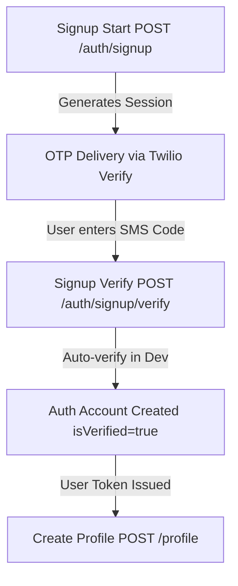
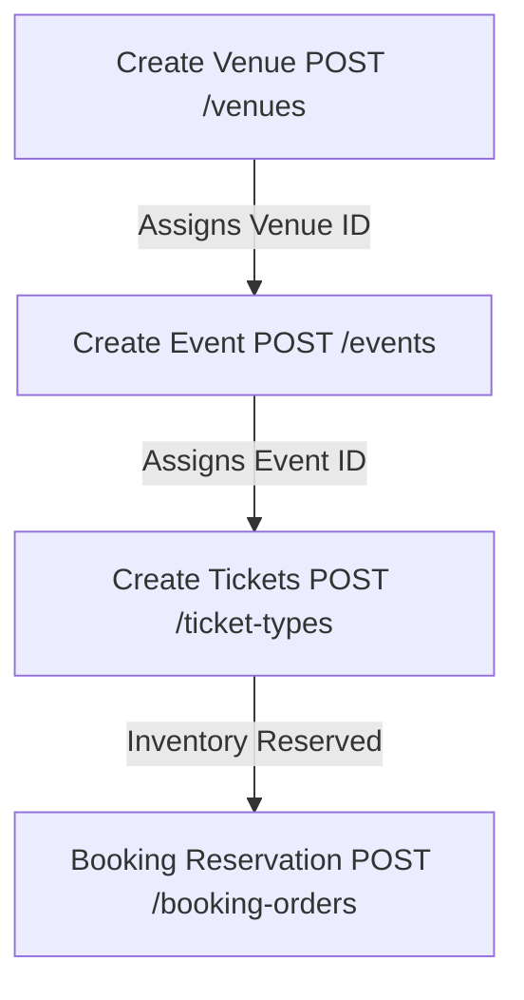
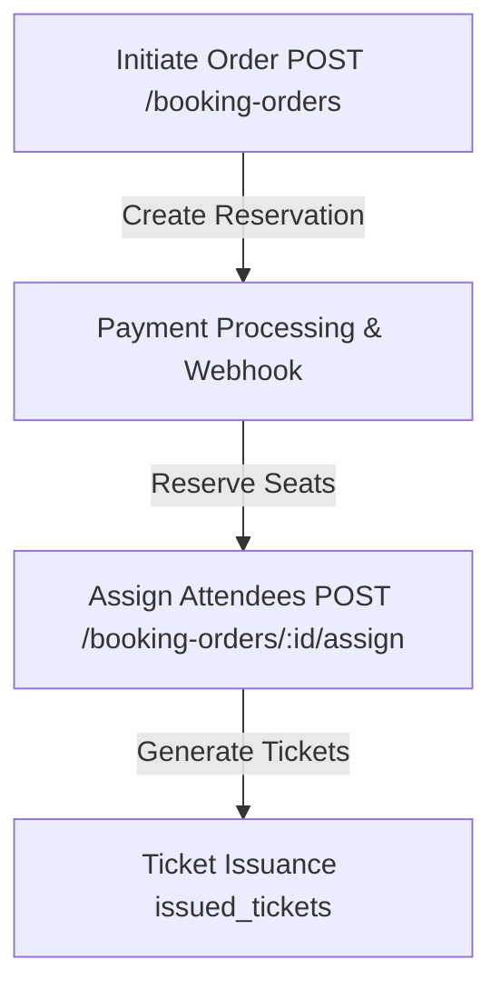
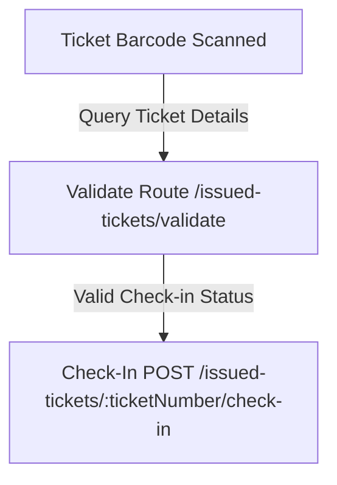
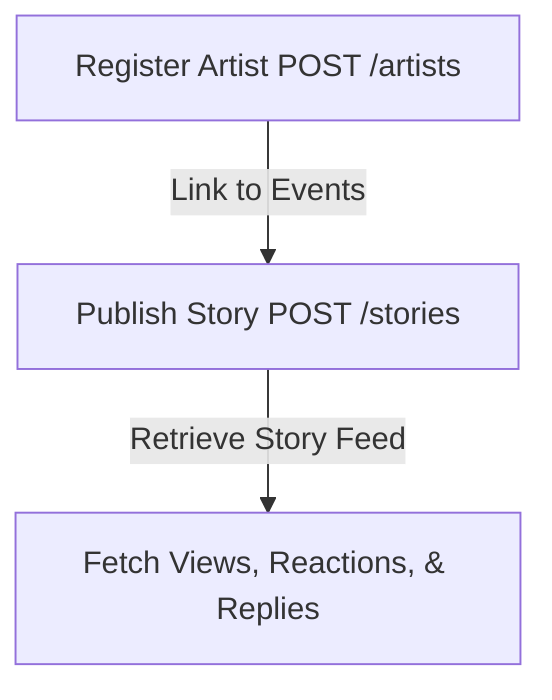
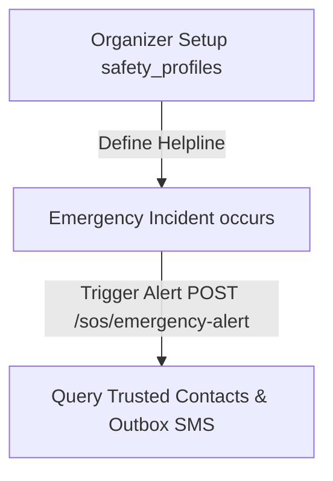
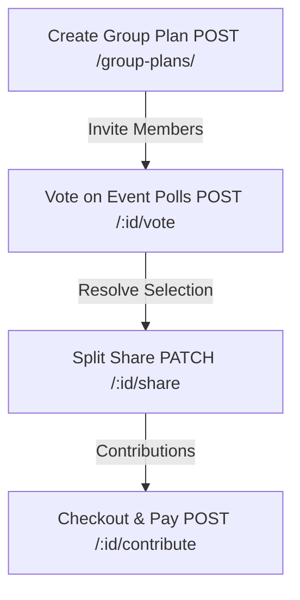

# System Integration Audits & Failure Analysis

This report evaluates end-to-end user workflows, detailing the integrations between modules and identifying the exact breaking points, validation mismatches, and structural vulnerabilities.

---

## 1. User Signup & Onboarding Workflow

### Target Workflow Path

### Integration Details
*   **Initialization**: The `/auth/signup` and `/auth/signup/start` endpoints validate input using `signupStartSchema`, verify unique fields, and create a pending record in `signup_verification_sessions`.
*   **Verification**: The `/auth/signup/verify` endpoint checks the SMS code. In development, `AUTH_BYPASS_OTP_VERIFICATION=true` accepts any 6-digit code. In production, this validates against Twilio.
*   **Account Generation**: Upon successful OTP verification, the backend writes a user record to `users`, creates an auth credential mapping in `auth_accounts`, and returns access/refresh JWTs.
*   **Profile Linkage**: The client calls `POST /profile` using the bearer token to create preferences and demographic linkages in `profiles`.

### Failure Points & Evidence

> [!CRITICAL]
> **Postman Schema Key Mismatch**
> The Zod validation schema `signupStartSchema` requires `fullName` (camelCase) and `phoneNumber`. The automated Postman collection passes `full_name` (snake_case) and completely lacks `phoneNumber`. This triggers a `400 Bad Request` validation error, blocking all downstream tests.

> [!WARNING]
> **Static Verification Session ID**
> The Postman test suite uses a hardcoded, static UUID (`session_8a883b2a-f8f4-42cc-971c-3b9ff0123456`) in the payload for `/auth/signup/verify`. Because there is no Postman pre-request/test script extracting the dynamic `verificationSessionId` returned by the start route, verification attempts fail in the collection runner.

> [!CAUTION]
> **JWT Parsing Unhandled Exception**
> When `/auth/refresh` or `/auth/logout` is called with a dummy placeholder string like `'jwt_refresh_token'`, the utility `verifyJwt` throws a raw runtime error during `.split('.')` array indexing, returning a `500 Internal Server Error` instead of a controlled `401 Unauthorized` response.

---

## 2. Event Setup & Ticket Inventory Workflow

### Target Workflow Path

### Integration Details
*   **Venue Creation**: Tenant Owners or Admins populate geographic coordinates and capacity.
*   **Event Definition**: An event is instantiated under a specific venue, inheriting its tenant scope.
*   **Ticket Configuration**: Ticket types represent seat tiers with explicit inventory allocations.
*   **Hold Phase**: Booking requests lock inventory items in `inventory_reservations` to prevent overselling.

### Failure Points & Evidence

| Failure Point | Cause | Risk | Severity |
|:---|:---|:---|:---|
| **Inventory Hold Deadlock** | Concurrent checkout requests locking rows in `inventory_reservations` without sorting keys. | Database transaction lock escalation/deadlock crash. | **High** |
| **Missing Tenant Context** | Request headers missing `x-tenant-slug` or path variable scoping. | Scoping middleware block (`401 Tenant context required`). | **Medium** |
| **Cascade Data Loss** | Deep relation mapping (`onDelete: 'cascade'`) linked directly to the parent `tenants` table. | Accidental deletion of a Tenant purges all venues, events, tickets, and bookings. | **High** |

---

## 3. Booking checkout & Attendee Assignment Workflow

### Target Workflow Path

### Integration Details
*   **Checkout**: The buyer creates a booking order. The database locks capacity bounds.
*   **Assignment**: The purchaser inputs the individual names and email addresses for each seat using `/booking-orders/:id/assign`.
*   **Issuance**: The server creates `issued_tickets` records, snapshotting pricing fields to lock historical invoice values.

### Failure Points & Evidence

> [!NOTE]
> **Postman State Tracking Failure**
> The Postman collection runner fails to map the dynamic `id` of the created booking order into subsequent attendee assignment requests. As a result, the runner attempts requests against placeholder IDs, failing with `401 Unauthorized` due to lack of token or `404 Not Found`.

> [!WARNING]
> **Relational Duplicate Keys**
> Re-running attendee assignment with duplicate email parameters causes internal database conflict warnings because the database handles matching logic on attendee indexes without fallback exception catches.

---

## 4. Gate Validation & Check-In Workflow

### Target Workflow Path

### Integration Details
*   **Validation**: Scanner queries ticket number details to ensure validity, date match, and active payment status.
*   **Check-in**: The ticket is marked as scanned, logging timestamp and updating status in `issued_tickets` to prevent duplicate entries.

### Failure Points & Evidence

> [!CRITICAL]
> **Staff Role Blocked from Check-In**
> The gate scanner check-in endpoint requires the `ticket.checkin` permission. The validation route requires `ticket.checkin` or `ticket.read`.
> **The staff role does NOT contain these permissions** in `src/lib/permissions.ts`. Event gate operators assigned the `staff` role are blocked with a `403 Forbidden` error, making check-ins impossible.

---

## 5. Artist Engagement & Stories System

### Target Workflow Path

### Integration Details
*   **Registration**: Artists are linked to tenant identifiers.
*   **Story Publishing**: Artists upload short-form media, writing assets to `media_assets` and linking them via `media_links`.
*   **Social Interactions**: Viewers react, read, and reply.

### Failure Points & Evidence

> [!WARNING]
> **Severe N+1 Performance Issue**
> The `getStories` service loops through story rows using `.map(async story => ...)` and triggers three database queries for *every story* (`getStoryViewsCount`, `getStoryReactions`, `getStoryReplies`). This multiplies database load exponentially under standard production traffic.

---

## 6. Organizer safety profiles & SOS Alerts

### Target Workflow Path

### Integration Details
*   **Profiles**: Organizers record emergency guidelines and list helpline contacts.
*   **SOS Trigger**: Users trigger safety alerts, looking up organizer contact lines and dispatching emergency outbox notifications.

### Failure Points & Evidence

*   **Helpline Redundancy**: The emergency helpline number is duplicated in both `organizers` and `organizer_safety_profiles` tables, creating data divergence risks.
*   **Notification Delivery Outbox Stagnation**: The email outbox registers the alert, but the background worker fails to send the real alert because the Brevo key and SMTP configurations are dummy variables.

---

## 7. Group Booking, Voting & Checkout

### Target Workflow Path

### Integration Details
*   **Plans**: Organizers establish plan details.
*   **Voting**: Members vote on event preferences.
*   **Checkout Split**: Shares are allocated, and members pay their portion to resolve the group booking order.

### Failure Points & Evidence

> [!NOTE]
> **Postman Chain Validation Failure**
> The multi-step group voting flow requires passing dynamic IDs between requests (Plan ID -> Vote Option ID -> Checkout ID). Because the automated Postman runner uses static placeholders, it cannot test the state transitions.

> [!WARNING]
> **Plan Retrieval N+1 Query**
> Retrieving group plan details loops through members and plan activities, querying details individually in a loop, creating high database overhead.
