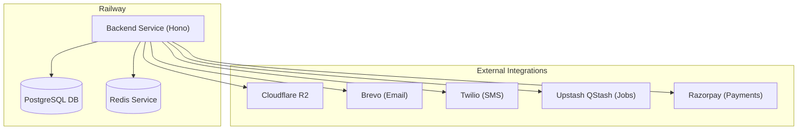

# Revelis Backend — Railway Deployment Guide (Concise)

A streamlined, action-oriented guide to deploying the Revelis Hono backend on Railway.

> **No CI/CD pipeline.** This repo has no GitHub Actions workflow. Railway builds
> and deploys directly from the root `Dockerfile` on every push to the connected
> branch — nothing else is required. Run the local checks in §1 before pushing,
> since there's no automated pipeline to catch a broken build for you.

---

## 1. Before You Push — Local Checks

Run these from `backend/` before every deploy so a broken build never reaches Railway:

```bash
npm run build                       # TypeScript compiles cleanly (tsc)
npx eslint src/ --max-warnings=0    # optional: lint check
docker build -t revelis-backend .   # optional: confirms the image actually builds
```

If `docker` is available locally, a full local run against the Dockerfile catches
anything the Railway build would also hit (missing files in `COPY`, etc.):

```bash
docker build -t revelis-backend .
docker run --rm -p 3000:3000 --env-file .env.production \
  -e SKIP_SERVICE_WAIT=true -e RUN_MIGRATIONS=false \
  revelis-backend
```

---

## 2. Architecture Map



---

## 3. Startup & Boot Sequence
1. **Health Check Wait (`dist/db/wait.js`)**: Blocks app boot until PostgreSQL & Redis are online (30 retries).
2. **Migrations (`dist/db/migrate.js`)**: Runs Drizzle migrations automatically on boot if `RUN_MIGRATIONS=true`.
3. **HTTP Server**: Starts `node dist/index.js` on port `3000` (mapped by Railway).

---

## 4. Step-by-Step Deployment

### Step 4.1: Create Project & Provision Databases
1. **Create Project**: Go to [Railway](https://railway.app) -> **New Project** -> **Empty Project**.
2. **Add PostgreSQL**: Click **+ Add Service** -> **Database** -> **Add PostgreSQL**.
3. **Add Redis**: Click **+ Add Service** -> **Database** -> **Add Redis**.

### Step 4.2: Add Backend App Service
1. Click **+ Add Service** -> **GitHub Repo** -> Select repository (or **Deploy from local directory** via the [Railway CLI](https://docs.railway.com/guides/cli) if the repo isn't on GitHub).
2. Railway automatically detects the root `Dockerfile` and builds directly from it — no GitHub Actions, container registry, or separate pipeline required.
3. Pause or delay deployment until environment variables are configured.

---

## 5. Environment Variables Checklist
Set these in your Backend Service under the **Variables** tab.

### Required Infrastructure
* **`NODE_ENV`**: `production`
* **`PORT`**: `3000`
* **`DATABASE_URL`**: `${{Postgres.DATABASE_URL}}`
* **`REDIS_URL`**: `${{Redis.REDIS_URL}}`
* **`RUN_MIGRATIONS`**: `true`
* **`SKIP_SERVICE_WAIT`**: `false`

### JWT Secrets (Must be ≥32 chars and not start with `dev-`)
* **`ACCESS_TOKEN_SECRET`**: *[Secure String]*
* **`REFRESH_TOKEN_SECRET`**: *[Secure String]*

### External Integrations
* **CORS**: 
  * `CORS_ORIGINS`: `https://your-frontend.com` *(no trailing slash)*
* **Cloudflare R2**:
  * `CLOUDFLARE_ACCOUNT_ID`: *[CF ID]*
  * `BUCKET_NAME`: *[Bucket Name]*
  * `ACCESS_KEY_ID`: *[Access Key]*
  * `SECRET_KEY_ID`: *[Secret Key]*
  * `S3_ENDPOINT`: `https://<ACCOUNT_ID>.r2.cloudflarestorage.com`
  * `CDN_BASE_URL`: *[CDN URL]*
  * `MEDIA_BYPASS_STORAGE`: `false`
* **Brevo Email**:
  * `BREVO_API_KEY`: `xkeysib-...`
  * `BREVO_SMTP_KEY`: `xsmtpsib-...`
  * `EMAIL_PROVIDER`: `brevo`
  * `EMAIL_FROM`: `noreply@yourdomain.com`
  * `EMAIL_FROM_NAME`: `Revelis`
  * `EMAIL_FROM_ADDRESS`: `noreply@yourdomain.com`
* **Twilio SMS**:
  * `AUTH_BYPASS_OTP_VERIFICATION`: `false`
  * `TWILIO_ACCOUNT_SID`: `AC...`
  * `TWILIO_AUTH_TOKEN`: *[Auth Token]*
  * `TWILIO_VERIFY_SERVICE_SID`: `VA...`
  * `TWILIO_PHONE_NUMBER`: *[Phone Number]*
  * `SMS_PROVIDER`: `twilio`
* **Upstash QStash**:
  * `QSTASH_TOKEN`: *[QStash Token]*
  * `QSTASH_CURRENT_SIGNING_KEY`: *[Signing Key]*
  * `QSTASH_NEXT_SIGNING_KEY`: *[Next Signing Key]*
  * `QSTASH_URL`: `https://qstash.upstash.io`
* **Razorpay Payments**:
  * `RAZORPAY_MODE`: `production` *(or `test`)*
  * `RAZORPAY_KEY_ID`: `rzp_live_...`
  * `RAZORPAY_KEY_SECRET`: *[Secret]*
  * `RAZORPAY_WEBHOOK_SECRET`: *[Webhook Secret]*

---

## 6. Domain & CORS Configuration
1. Go to **Backend Service** -> **Settings** -> **Networking**.
2. Click **Generate Domain** or add a **Custom Domain**.
3. Ensure port `3000` is exposed.
4. Set `CORS_ORIGINS` to your frontend URL.

---

## 7. Verification
Monitor **Deploy Logs** on the backend service to verify successful initialization:

1. **Verify Startup Logs**:
   ```text
   [Startup Wait] Database connection successful.
   [Startup Wait] Redis connection successful.
   [Entrypoint] Running database migrations...
   Migrations completed successfully.
   [Server] Server is running on port 3000
   ```

2. **Liveness Check**:
   ```bash
   curl -I https://your-railway-domain.railway.app/health/live
   # Expected: HTTP 200 OK
   ```

3. **Readiness Check (Validates all integrations)**:
   ```bash
   curl https://your-railway-domain.railway.app/health/ready
   # Expected: HTTP 200 with JSON statuses healthy
   ```
