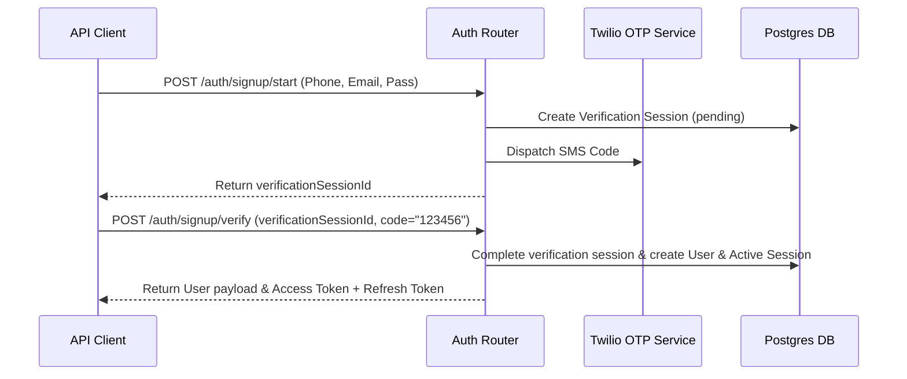

# Revelis Authentication Lifecycle Guide

Revelis utilizes a two-step OTP validation flow for phone signup and email verify:

### Pre-configured Automation Script
All authentication folders have been enriched with Postman test scripts that parse response payloads and update `{{token}}` and `{{refreshToken}}` variables.
