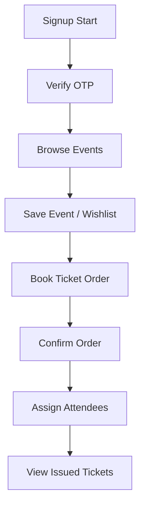

# Workflow: Attendee Journey

### API Executions:
1. `POST /auth/signup/start` -> Returns session ID.
2. `POST /auth/signup/verify` -> Returns access token.
3. `GET /events` -> Retrieve event lists.
4. `POST /wishlists/events/:eventId` -> Add to favorites.
5. `POST /booking-orders` -> Reserves tickets.
6. `POST /booking-orders/:orderNumber/assign-attendees` -> Assigns names.
