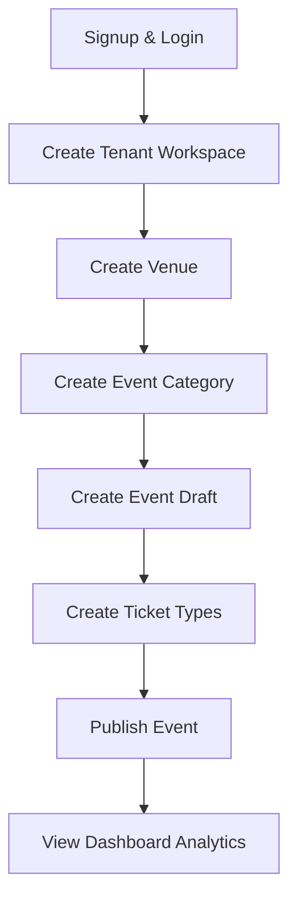

# Workflow: Organizer Journey

### API Executions:
1. `POST /auth/login` -> Gets access token.
2. `POST /tenants` -> Creates tenant & binds slug.
3. `POST /venues` -> Creates physical location.
4. `POST /events` -> Creates event in 'draft' state.
5. `POST /ticket-types` -> Adds VIP and General Admission pricing.
6. `PATCH /events/:slug` -> Changes state to 'published'.
